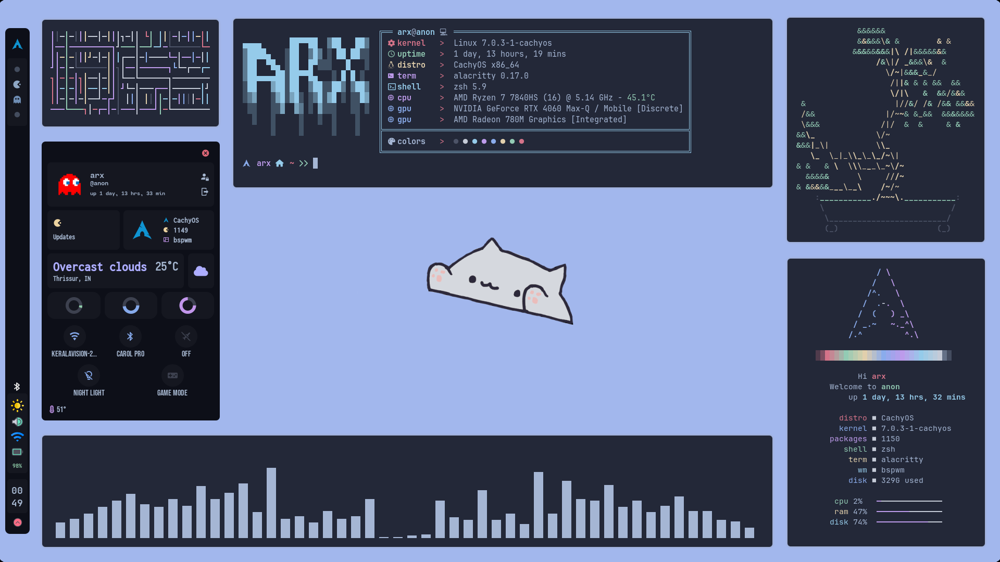

<div align="center">

# Dotfiles

**A minimal, laptop-friendly BSPWM rice with EWW widgets, focused on stability and simplicity.**

[](https://archlinux.org/)
[](https://www.zsh.org/)
[]()

<strong><a href="#quick-start">Quick Start</a> · <a href="#features">Features</a> · <a href="#preview">Preview</a> · <a href="#configuration">Configuration</a></strong>

</div>

---

## Overview

This is a streamlined and customized version of [gh0stzk's dotfiles](https://github.com/gh0stzk/dotfiles), rebuilt with a focus on stability, minimalism and laptop compatibility.

While the original project is an incredible showcase of ricing (featuring 18 unique themes across EWW and Polybar), it relies heavily on custom package sources like the `gh0stzk-dotfiles` pacman repo and `chaotic-aur`. Because I prefer to keep my core system free of third-party repositories, I created this standalone version. 

## Preview



## Features

- **Window Manager**: [BSPWM](https://github.com/baskerville/bspwm) - A tiling window manager that represents windows as leaves of a binary tree.
- **Widgets & Bar**: [EWW](https://github.com/elkowar/eww) - Side/Top bar (workspace highlighting, battery, brightness, volume, network) plus custom widgets for system info, media player, calendar, and more.
- **Terminal**: [Alacritty](https://github.com/alacritty/alacritty) & [Kitty](https://github.com/kovidgoyal/kitty) configurations with custom themes.
- **Launcher**: [Rofi](https://github.com/davatorium/rofi) for application launching and window switching.
- **Fetch Tool**: Custom `sysfetch` script for a clean system overview.
- **Theme Engine**: Includes the `z0mbi3` (minimal) and `andrea` rices with easy switching via a custom script.
- **Notifications**: [Dunst](https://github.com/dunst-project/dunst) for lightweight and customizable desktop notifications.

## Quick Start

### Prerequisites

This rice is built for an **Arch Linux** or **Arch-based** distribution (e.g., CachyOS, EndeavourOS, Manjaro).

> [!WARNING]
>
> Do NOT run the install scripts as root.

### Installation

1.  **Clone the repository:**

    ```bash
    git clone https://github.com/ussooraj/bspwm-dotfiles.git
    cd bspwm-dotfiles
    ```

2.  **Run the automated installer:**

    ```bash
    ./install.sh
    ```

    The installer will:
    - Install all core and AUR dependencies.
    - Install optional packages (SDDM, btop, etc.) based on your input.
    - Backup your existing configurations to `~/.RiceBackup/`.
    - Deploy all configuration files.
    - Enable necessary services (`mpd`, `mpDris2`).

3.  **Reboot:**

    After installation, log out and select `bspwm` from your display manager, or simply reboot.

## Configuration

All configuration files are stored in the `config/` directory and map directly to `~/.config/` after installation.

| Component    | Description                             | Configuration Files                     |
|:-------------|:----------------------------------------|:----------------------------------------|
| BSPWM        | Tiling window manager                   | [bspwmrc](config/bspwm/bspwmrc)         |
| SXHKD        | Hotkey daemon                           | [sxhkdrc](config/bspwm/config/sxhkdrc)  |
| EWW          | Widgets and status bar                  | [eww/](config/bspwm/eww/)               |
| Dunst        | Notification daemon                     | [dunstrc](config/bspwm/config/dunstrc)  |
| Picom        | Compositor for transparency & effects   | [picom.conf](config/bspwm/config/picom.conf) |
| Rofi         | Application launcher                    | [rofi-themes/](config/bspwm/config/rofi-themes/) |
| Alacritty    | Terminal emulator                       | [alacritty.toml](config/alacritty/alacritty.toml) |
| Kitty        | Terminal emulator                       | [kitty.conf](config/kitty/kitty.conf)   |
| Zsh          | Shell configuration                     | [.zshrc](home/.zshrc)                   |
| GTK          | GTK theme settings                      | [settings.ini](config/gtk-3.0/settings.ini) |

### Keybindings

Default keybindings are managed via [SXHKD](https://github.com/baskerville/sxhkd). Refer to `config/bspwm/config/sxhkdrc` for the full list.

| Keybinding | Action |
|:-----------|:-------|
| `Alt + F1` | Show keybindings cheatsheet |
| `Super + Return` | Launch terminal (Alacritty) |
| `Super + Alt + Return` | Launch floating terminal |
| `Super + D` | Launch Rofi app launcher |
| `Super + Ctrl + U` | Open EWW profile card |
| `Super + Ctrl + C` | Open EWW calendar |
| `Super + B` | Launch browser |
| `Super + Alt + {H,U}` | Hide / unhide bar |
| `Super + Q` | Close focused window |
| `Super + Shift + Q` | Kill focused window |
| `Super + {Left,Down,Up,Right}` | Change window focus |
| `Super + Shift + {Left,Down,Up,Right}` | Move floating window |
| `Super + Alt + {Plus,Minus}` | Resize window |
| `Super + {1-9,0}` | Change workspace |
| `Super + Shift + {1-9,0}` | Move focused window to workspace |
| `Alt + Space` | Open theme selector (`RiceSelector`) |
| `Super + R` | Open theme editor (`RiceEditor`) |
| `Super + Alt + S` | Screenshot tool |
| `Super + Alt + P` | Power menu |
| `Super + G` | Toggle Game Mode |
| `Super + Ctrl + N` | Toggle Redshift (Night Mode) |
| `XF86Audio{Raise,Lower}Volume` | Volume control |
| `XF86MonBrightness{Up,Down}` | Brightness control |
| `XF86AudioPlay, XF86AudioNext, XF86AudioPrev` | Media control |


## Acknowledgements

- **Original Creator**: [gh0stzk](https://github.com/gh0stzk/dotfiles) - The incredible foundation and inspiration for this setup.

## License

This project is licensed under the **GPL-3.0** License. See the [LICENSE](LICENSE) file for details.
